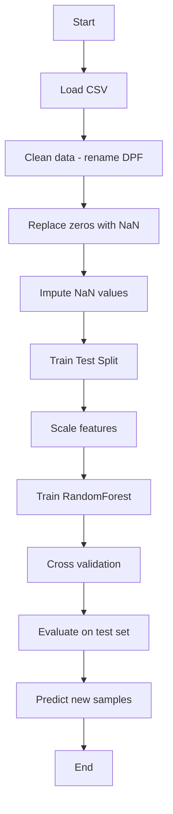
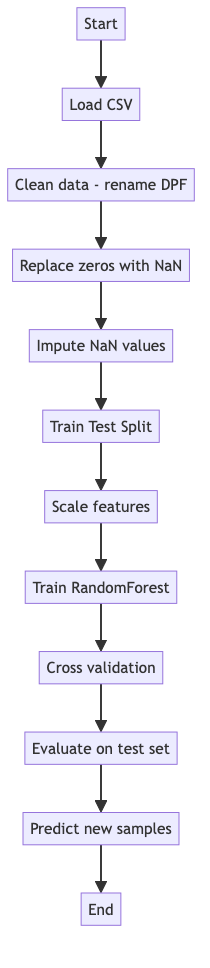

# Diabetes Prediction Pipeline Documentation

This document visualises and describes the machine-learning pipeline implemented in `diabetes_prediction.py` / *Diabetes Classification.ipynb*.

---

## Flowchart (Mermaid)


### Static image
If your viewer cannot render Mermaid, see the exported PNG:



---

## Pseudocode

```text
LOAD csv_path (default "kaggle_diabetes.csv")
RENAME column "DiabetesPedigreeFunction" -> "DPF"
FOR each col in [Glucose, BloodPressure, SkinThickness, Insulin, BMI]:
    REPLACE 0 with NaN

IMPUTE missing values:
    Glucose, BloodPressure  <- mean
    SkinThickness, Insulin, BMI <- median

SPLIT dataset into X (features) and y (Outcome)
TRAIN_TEST_SPLIT X, y (test_size = 0.2, random_state = 0)

FIT StandardScaler on X_train → X_train_scaled
TRANSFORM X_test with same scaler → X_test_scaled

INITIALISE RandomForestClassifier(n_estimators = 20, random_state = 0)
FIT model on X_train_scaled, y_train

OPTIONAL: CROSS_VAL_SCORE (cv = 5) to estimate average accuracy

EVALUATE model on X_test_scaled:
    confusion_matrix, accuracy_score, classification_report

DEFINE predict_diabetes(scaler, classifier, feature_vector):
    vector_scaled = scaler.transform([feature_vector])
    RETURN classifier.predict(vector_scaled)[0]

DEMO: call predict_diabetes with sample inputs and print human-readable messages
```
